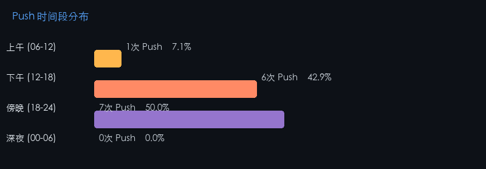
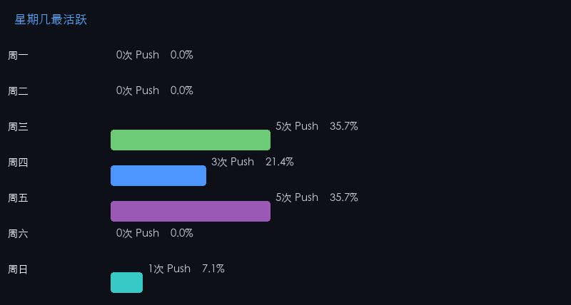
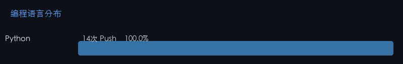

# 👋 嗨，我是 jyh20030112

> 📊 以下数据由 GitHub Actions 自动更新 | 最后更新: 2026-05-22 09:47 UTC

---

## 📈 我的编码活动统计

基于最近 14 次 Push 记录：

| 🕐 最活跃时段 | 📆 最活跃星期 | 💻 最常用语言 |
|:---:|:---:|:---:|
| 傍晚 🌆 | 周五 | Python |

---

### 🕐 Push 时间段分布

  

### 📆 星期几最活跃

  

### 💻 编程语言分布

  

---

🤖 关于这些统计

 
这些图表通过 GitHub Actions 自动生成，每天定时更新。统计基于我最近的公开 Push 事件。

