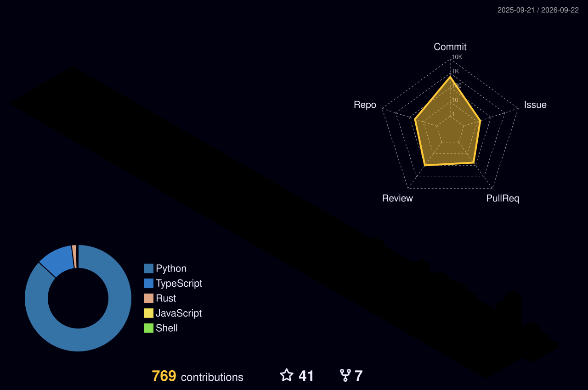

<table style="border-color: transparent;" cellspacing=0>
<tr>
<td valign="center" width="62%">

# Building with AI

**Artificial Intelligence**

I build around AI: tools, systems, and experiments that turn vague ideas into usable workflows.

**Tools & Systems**

I care about the moment when intelligence stops being only a chat box and starts becoming something that can plan, call tools, remember context, and help with real work.

**Open Questions**

How should humans collaborate with AI when the answer is not only text, but also an action, a process, or a small system?

</td>
<td valign="top" width="38%">
<p align="right">

***

> Human × AI, not Human vs. AI

***



***

> 把想法变成可运行的小系统

***

</p>
</td>
</tr>
</table>

<table style="border-color: transparent;" cellspacing=0>
<tr>
<td valign="top" width="64%">

[](https://www.python.org/)
[](https://github.com/jyh20030112)
[](https://github.com/jyh20030112)

<!--START_SECTION:profile-stats-->
**Coding Rhythm**

> 数据由 GitHub Actions 自动更新 | Last Updated: 2026-08-03 09:26 UTC

基于最近 **88** 次公开 Push 记录：

| Most Active Time | Most Productive Day | Main Language |
|:---:|:---:|:---:|
| 傍晚 🌆 | 周四 | Python |

### Time Distribution

```text
🌞 上午 (06-12)      6次 Push  █░░░░░░░░░░░░░░░░░░░░░░░░    6.8 %
🌆 下午 (12-18)     24次 Push  ██████░░░░░░░░░░░░░░░░░░░   27.3 %
🌃 傍晚 (18-24)     43次 Push  ████████████░░░░░░░░░░░░░   48.9 %
🌙 深夜 (00-06)     15次 Push  ████░░░░░░░░░░░░░░░░░░░░░   17.0 %
```

### Weekday Distribution

```text
🐔 周一     14次 Push  ███░░░░░░░░░░░░░░░░░░░░░░   15.9 %
🐱 周二     14次 Push  ███░░░░░░░░░░░░░░░░░░░░░░   15.9 %
🐶 周三     20次 Push  █████░░░░░░░░░░░░░░░░░░░░   22.7 %
🐮 周四     23次 Push  ██████░░░░░░░░░░░░░░░░░░░   26.1 %
🐯 周五      6次 Push  █░░░░░░░░░░░░░░░░░░░░░░░░    6.8 %
🐰 周六      4次 Push  █░░░░░░░░░░░░░░░░░░░░░░░░    4.5 %
🐲 周日      7次 Push  █░░░░░░░░░░░░░░░░░░░░░░░░    8.0 %
```

### Language Distribution

```text
Python          1.2 MB  ████████████████░░░░░░░░░   67.5 %
TypeScript    158.1 KB  ██░░░░░░░░░░░░░░░░░░░░░░░    8.9 %
HTML          138.2 KB  █░░░░░░░░░░░░░░░░░░░░░░░░    7.8 %
Other         280.4 KB  ███░░░░░░░░░░░░░░░░░░░░░░   15.8 %
```
<!--END_SECTION:profile-stats-->

</td>
<td valign="top" width="36%">

**Currently**

> Building around AI

<table style="border-color: transparent;" cellspacing=0>
  <tr>
    <td valign="center">AI-native tools</td>
  </tr>
  <tr>
    <td valign="center">Agentic workflows</td>
  </tr>
  <tr>
    <td valign="center">Human-AI collaboration</td>
  </tr>
  <tr>
    <td valign="center">Small intelligent systems</td>
  </tr>
</table>

**Traces**

<table style="border-color: transparent;" cellspacing=0>
  <tr>
    <td valign="center">
      <a href="https://github.com/jyh20030112">
        
      </a>
    </td>
  </tr>
  <tr>
    <td valign="center">
      <a href="https://github.com/jyh20030112">
        
      </a>
    </td>
  </tr>
  <tr>
    <td valign="center">
      <a href="https://github.com/jyh20030112">
        
      </a>
    </td>
  </tr>
  <tr>
    <td valign="center">
      <a href="https://github.com/jyh20030112">
        
      </a>
    </td>
  </tr>
</table>

</td>
</tr>
</table>

<table style="border-color: transparent;" cellspacing=0>
<tr>
<td valign="top" width="34%">

### Direction

AI as a material for building.

Not only prompts, not only models, but interfaces, tools, memory, workflows, and the quiet parts that make intelligence useful.

</td>
<td valign="top" width="33%">

### Experiments

Small systems first.

I like projects that can be touched, run, broken, repaired, and slowly shaped into something clearer.

</td>
<td valign="top" width="33%">


</td>
</tr>
</table>

<details>
<summary>About the activity stats</summary>
<br>

These charts are generated from recent public Push events. Language distribution aggregates GitHub language bytes from repositories that appear in those Push events, then renders everything as Unicode text bars.

</details>

<p align="right">Building with AI, one small system at a time.</p>
